# Guía Técnica: Implementación de Balanceo de Carga para Moodle con Docker y NGINX

**Universidad Politécnica Estatal del Carchi (UPEC)**  
**Entorno Virtual de Aprendizaje — Infraestructura de Alta Disponibilidad**

---

## Índice

1. [Introducción](#1-introducción)
2. [Fundamentos Teóricos](#2-fundamentos-teóricos)
   - 2.1 [Balanceo de Carga](#21-balanceo-de-carga)
   - 2.2 [Alta Disponibilidad](#22-alta-disponibilidad)
   - 2.3 [Escalabilidad Horizontal](#23-escalabilidad-horizontal)
   - 2.4 [Arquitectura Stateless y Estado Compartido](#24-arquitectura-stateless-y-estado-compartido)
   - 2.5 [Algoritmos de Balanceo de Carga](#25-algoritmos-de-balanceo-de-carga)
   - 2.6 [Contenedorización con Docker](#26-contenedorización-con-docker)
   - 2.7 [Reverse Proxy](#27-reverse-proxy)
   - 2.8 [NFS como Almacenamiento Compartido](#28-nfs-como-almacenamiento-compartido)
   - 2.9 [Redis como Gestor de Sesiones y Caché](#29-redis-como-gestor-de-sesiones-y-caché)
3. [Arquitectura del Sistema](#3-arquitectura-del-sistema)
   - 3.1 [Descripción General](#31-descripción-general)
   - 3.2 [Mapa de Servidores y Roles](#32-mapa-de-servidores-y-roles)
   - 3.3 [Flujo de una Solicitud HTTP](#33-flujo-de-una-solicitud-http)
   - 3.4 [Componentes y Justificación de Tecnologías](#34-componentes-y-justificación-de-tecnologías)
4. [Implementación](#4-implementación)
   - 4.1 [Instalación de Docker Engine (todos los servidores)](#41-instalación-de-docker-engine-todos-los-servidores)
   - 4.2 [Base de Datos MariaDB y Redis (Servidor 1)](#42-base-de-datos-mariadb-y-redis-servidor-1)
   - 4.3 [Servidor NFS — Almacenamiento Compartido (Servidor 2)](#43-servidor-nfs--almacenamiento-compartido-servidor-2)
   - 4.4 [Nodos de Aplicación Moodle (Servidores 4 y 5)](#44-nodos-de-aplicación-moodle-servidores-4-y-5)
   - 4.5 [Balanceador de Carga NGINX (Servidor 3)](#45-balanceador-de-carga-nginx-servidor-3)
5. [Verificación y Pruebas](#5-verificación-y-pruebas)
   - 5.1 [Verificar conectividad entre contenedores](#51-verificar-conectividad-entre-contenedores)
   - 5.2 [Verificar balanceo de carga](#52-verificar-balanceo-de-carga)
   - 5.3 [Verificar sesiones en Redis](#53-verificar-sesiones-en-redis)
   - 5.4 [Verificar almacenamiento NFS](#54-verificar-almacenamiento-nfs)
6. [Errores Comunes y Soluciones](#6-errores-comunes-y-soluciones)
7. [Conclusión](#7-conclusión)

---

## 1. Introducción

El presente documento describe el proceso de diseño e implementación de una arquitectura de balanceo de carga web para el Entorno Virtual de Aprendizaje (EVA) de la UPEC, basado en la plataforma Moodle. La solución utiliza exclusivamente componentes de software libre y contenedores Docker.

El crecimiento en el número de usuarios concurrentes en plataformas de e-learning genera presión sostenida sobre la infraestructura de cómputo. Un despliegue de instancia única representa un punto único de fallo (SPOF, por sus siglas en inglés) y limita la capacidad de respuesta ante picos de demanda, como los que ocurren durante evaluaciones o el inicio de semestres académicos.

La arquitectura propuesta resuelve este problema mediante la distribución del tráfico HTTP entre múltiples instancias de Moodle que operan de forma simultánea, gestionando el estado compartido (sesiones, caché y archivos) a través de servicios centralizados. El resultado es un sistema con alta disponibilidad, tolerancia a fallos y capacidad de crecimiento horizontal sin necesidad de modificar la arquitectura base.

---

## 2. Fundamentos Teóricos

### 2.1 Balanceo de Carga

El balanceo de carga es una técnica de distribución de tráfico de red entre múltiples servidores con el objetivo de optimizar el uso de recursos, maximizar el rendimiento, minimizar la latencia de respuesta y evitar la sobrecarga de cualquier servidor individual.

Desde el punto de vista técnico, un balanceador de carga opera interceptando las solicitudes entrantes antes de que lleguen a los servidores de aplicación. Actúa como intermediario que, basándose en un algoritmo de distribución, decide a qué servidor backend debe enviarse cada solicitud.

En este proyecto, el balanceo opera en la **Capa 7 del modelo OSI** (capa de aplicación), lo que permite al balanceador inspeccionar el contenido HTTP de la solicitud —cabeceras, URL, cookies— para tomar decisiones de enrutamiento más precisas que un balanceo de capa 4 (transporte), que únicamente analiza IPs y puertos.

### 2.2 Alta Disponibilidad

La alta disponibilidad (HA) se define como la capacidad de un sistema de mantenerse operativo y accesible durante un porcentaje elevado del tiempo total, incluso ante fallos de componentes individuales. Se expresa habitualmente como un porcentaje de uptime anual (por ejemplo, 99,9% equivale a un máximo de 8,76 horas de interrupción al año).

En esta arquitectura, la alta disponibilidad se logra mediante:

- **Redundancia activa de nodos Moodle**: múltiples instancias sirven tráfico simultáneamente. Si un nodo falla, el balanceador detecta la caída y deja de enrutar solicitudes hacia él automáticamente.
- **Mecanismo de failover en NGINX**: a través de los parámetros `max_fails` y `fail_timeout`, NGINX monitorea la salud de cada backend y lo marca como no disponible cuando supera el umbral de errores configurado.
- **Estado externalizado**: el fallo de un nodo de aplicación no implica pérdida de sesiones ni datos, ya que estos residen en servicios independientes (Redis y MariaDB).

### 2.3 Escalabilidad Horizontal

La escalabilidad es la capacidad de un sistema de adaptarse al incremento de carga sin degradar su rendimiento. Existen dos enfoques:

- **Escalabilidad vertical**: consiste en aumentar los recursos de hardware de un servidor existente (más CPU, más RAM). Tiene un límite físico y genera tiempos de inactividad durante la actualización.
- **Escalabilidad horizontal**: consiste en agregar más servidores al pool de recursos. No tiene un límite teórico impuesto por el hardware individual y puede realizarse sin interrumpir el servicio.

Esta arquitectura está diseñada para escalar horizontalmente. Agregar un nuevo nodo Moodle se reduce a: desplegar el contenedor en un nuevo servidor con la misma configuración y registrar su IP en el bloque `upstream` de la configuración de NGINX. No se requieren cambios en la base de datos, en Redis ni en NFS.

### 2.4 Arquitectura Stateless y Estado Compartido

Una aplicación web es **stateless** (sin estado) cuando cada instancia de servidor puede procesar cualquier solicitud de cualquier usuario sin depender de información almacenada localmente en esa instancia. Esto es un requisito fundamental para el balanceo de carga: si la instancia A guardara la sesión de un usuario en su memoria local, una solicitud posterior de ese mismo usuario enrutada a la instancia B fallaría.

Moodle, por defecto, almacena las sesiones en el sistema de archivos del servidor. Esto lo hace incompatible con un entorno multi-nodo a menos que se configure para externalizar el estado. En esta arquitectura, el estado se externaliza en tres capas:

| Capa de estado | Tecnología | Propósito |
|---|---|---|
| Sesiones de usuario | Redis | Almacén en memoria de alta velocidad para datos de sesión PHP |
| Caché de aplicación | Redis | Caché de consultas, permisos y datos de Moodle |
| Archivos del curso | NFS | Sistema de archivos compartido entre todos los nodos |
| Datos relacionales | MariaDB | Persistencia estructurada de toda la lógica de negocio |

Con este diseño, todos los nodos Moodle son funcionalmente idénticos e intercambiables: cualquier nodo puede atender a cualquier usuario en cualquier momento.

### 2.5 Algoritmos de Balanceo de Carga

NGINX en su versión open source soporta los siguientes métodos de distribución de tráfico:

| Algoritmo | Directiva NGINX | Descripción |
|---|---|---|
| **Round Robin** | *(predeterminado)* | Distribuye las solicitudes de forma cíclica y secuencial. Es el método más simple. Adecuado cuando todos los servidores tienen capacidad homogénea. |
| **Least Connections** | `least_conn;` | Envía la solicitud al servidor con el menor número de conexiones activas en ese momento. Adecuado cuando las solicitudes tienen tiempos de procesamiento variables. |
| **IP Hash** | `ip_hash;` | Calcula un hash a partir de la IP del cliente y siempre enruta esa IP al mismo servidor. Garantiza persistencia de sesión sin depender de Redis. No recomendado en esta arquitectura porque limita la distribución uniforme de carga. |
| **Generic Hash** | `hash $variable;` | Hash calculado sobre cualquier variable NGINX (URL, cookie, cabecera). Útil para casos de uso específicos. |

En esta implementación se utiliza **Least Connections** (`least_conn`), ya que Moodle genera solicitudes de duración muy variable: desde peticiones estáticas de pocos milisegundos hasta operaciones de carga de archivos o generación de reportes que pueden tardar segundos. Este algoritmo garantiza que ningún nodo acumule una cola de solicitudes largas mientras otro permanece ocioso.

### 2.6 Contenedorización con Docker

Docker es una plataforma de contenedorización que permite empaquetar una aplicación junto con todas sus dependencias en una unidad portable y reproducible denominada **imagen**. Un **contenedor** es una instancia en ejecución de dicha imagen.

Los contenedores utilizan namespaces y cgroups del kernel Linux para proporcionar aislamiento de procesos, red y sistema de archivos, sin la sobrecarga de una máquina virtual completa. Esto permite ejecutar múltiples contenedores en el mismo host de forma eficiente.

Las ventajas de esta arquitectura para el entorno en producción son:

- **Reproducibilidad**: el `Dockerfile` describe exactamente las dependencias y configuraciones. Elimina el problema del tipo "funciona en mi máquina".
- **Aislamiento**: los contenedores no interfieren entre sí ni con el sistema operativo anfitrión.
- **Gestión declarativa**: `docker-compose.yml` define el estado deseado del sistema. Levantar el stack completo se reduce a un solo comando.
- **Portabilidad**: la misma imagen puede ejecutarse en cualquier servidor con Docker instalado, independientemente de la distribución Linux.

### 2.7 Reverse Proxy

Un reverse proxy es un servidor que actúa en nombre de los servidores backend ante los clientes. El cliente nunca se comunica directamente con el servidor de aplicación; todas las solicitudes pasan por el proxy, que las reenvía al backend correspondiente y retorna la respuesta al cliente.

NGINX actúa simultáneamente como reverse proxy y balanceador de carga en esta arquitectura. Sus funciones incluyen:

- Reenviar la solicitud al nodo Moodle disponible
- Inyectar cabeceras HTTP que informan al backend la IP real del cliente (`X-Real-IP`, `X-Forwarded-For`)
- Gestionar la persistencia de conexiones HTTP hacia los backends (`keepalive`)
- Absorber solicitudes lentas de clientes (buffering), protegiendo los backends de conexiones que consumen recursos durante tiempos prolongados

### 2.8 NFS como Almacenamiento Compartido

NFS (Network File System) es un protocolo de sistema de archivos distribuido que permite a múltiples clientes montar y acceder a un directorio remoto como si fuera un directorio local. Fue desarrollado por Sun Microsystems en 1984 y es un estándar en entornos Unix/Linux.

En esta arquitectura, NFS resuelve el problema de la consistencia de archivos en un entorno multi-nodo. El directorio `moodledata` —que contiene archivos subidos por usuarios, repositorios de cursos, caché de archivos y datos de respaldo— debe ser accesible de forma idéntica por todos los nodos Moodle. Sin NFS, un archivo subido a través del Nodo 1 no estaría disponible para un usuario cuya siguiente solicitud fuera atendida por el Nodo 2.

La solución es montar el directorio NFS del servidor de almacenamiento como un volumen Docker en cada contenedor Moodle, de modo que todos los nodos lean y escriban en el mismo sistema de archivos de red.

### 2.9 Redis como Gestor de Sesiones y Caché

Redis (Remote Dictionary Server) es un almacén de estructuras de datos en memoria, de código abierto, que soporta persistencia opcional en disco. Funciona como base de datos clave-valor de altísima velocidad, con latencias de lectura y escritura del orden de microsegundos.

En el contexto de Moodle multi-nodo, Redis cumple dos funciones críticas:

**Gestión de sesiones PHP**: Moodle se configura para delegar el almacenamiento de sesiones a Redis mediante el parámetro `$CFG->session_handler_class = '\core\session\redis'`. Esto garantiza que, independientemente del nodo que atienda a un usuario, siempre se recupere la misma sesión activa.

**Caché de aplicación**: Moodle tiene un subsistema de caché (MUC — Moodle Universal Cache) que puede almacenar en Redis el resultado de operaciones costosas: cálculo de permisos, consultas frecuentes a base de datos, metadatos de cursos. Esto reduce la carga sobre MariaDB y mejora los tiempos de respuesta.

---

## 3. Arquitectura del Sistema

### 3.1 Descripción General

La arquitectura implementada distribuye los componentes de la plataforma Moodle en cinco servidores independientes, cada uno con un rol específico. El aislamiento de roles permite escalar, mantener o reemplazar cada componente sin afectar a los demás.

```
                    Usuarios / Internet
                           |
                           v
              +------------------------+
              |   NGINX (Servidor 3)   |
              |  Balanceador de carga  |
              |   172.20.208.174:80    |
              +------------------------+
                    /            \
                   /              \
                  v                v
    +-------------------+  +-------------------+
    |  Moodle Nodo 1    |  |  Moodle Nodo 2    |
    |  (Servidor 4)     |  |  (Servidor 5)     |
    |  172.20.208.173   |  |  172.20.208.169   |
    +-------------------+  +-------------------+
              |                    |
              +--------------------+
                         |
              +----------+----------+
              |                     |
              v                     v
  +-------------------+  +-------------------+
  |  MariaDB + Redis  |  |   NFS Server      |
  |  (Servidor 1)     |  |   (Servidor 2)    |
  |  172.20.208.122   |  |  172.20.208.167   |
  +-------------------+  +-------------------+
```

**Diagrama general de la arquitectura:**


**Diagrama detallado del flujo de balanceo de carga:**



### 3.2 Mapa de Servidores y Roles

| Servidor | IP | Rol | Componentes |
|---|---|---|---|
| Servidor 1 | 172.20.208.122 | Base de datos y caché | MariaDB 10.6, Redis (Alpine) |
| Servidor 2 | 172.20.208.167 | Almacenamiento compartido | NFS Server |
| Servidor 3 | 172.20.208.174 | Balanceador de carga | NGINX (stable) |
| Servidor 4 | 172.20.208.173 | Nodo de aplicación | Moodle (PHP 8.1 + Apache) |
| Servidor 5 | 172.20.208.169 | Nodo de aplicación | Moodle (PHP 8.1 + Apache) |

### 3.3 Flujo de una Solicitud HTTP

El siguiente diagrama describe el ciclo completo de una solicitud de usuario:

```
1. El usuario accede a http://172.20.208.174 desde su navegador.

2. NGINX recibe la solicitud y aplica el algoritmo least_conn:
   selecciona el nodo Moodle con menos conexiones activas.

3. NGINX reenvía la solicitud al nodo seleccionado, añadiendo
   las cabeceras X-Real-IP y X-Forwarded-For.

4. El nodo Moodle recibe la solicitud y consulta Redis para
   recuperar la sesión del usuario.

5. Moodle ejecuta la lógica de la solicitud, realizando las
   consultas necesarias a MariaDB.

6. Si la solicitud involucra archivos (subir o descargar),
   Moodle accede al directorio montado por NFS.

7. Moodle genera la respuesta HTML y la retorna al nodo NGINX.

8. NGINX retorna la respuesta al cliente.
```

### 3.4 Componentes y Justificación de Tecnologías

| Componente | Tecnología elegida | Alternativas consideradas | Justificación |
|---|---|---|---|
| Balanceador de carga | NGINX | HAProxy, Traefik | NGINX combina reverse proxy y balanceo en una sola herramienta madura, con amplia documentación y soporte comunitario |
| Contenedorización | Docker + Compose | Podman, k8s | Adopción masiva, curva de aprendizaje accesible y ecosistema de imágenes bien mantenido |
| Base de datos | MariaDB 10.6 | MySQL, PostgreSQL | Compatibilidad nativa con Moodle, drop-in replacement de MySQL, licencia GPL |
| Caché y sesiones | Redis | Memcached | Redis soporta persistencia en disco, más tipos de datos y es el recomendado por la documentación oficial de Moodle |
| Almacenamiento compartido | NFS | GlusterFS, Ceph | NFS es la solución más simple para compartir `moodledata` en redes locales; no requiere agentes adicionales en los clientes |

---

## 4. Implementación

> **Nota sobre el sistema operativo**: Los comandos de esta guía están optimizados para distribuciones basadas en Red Hat Enterprise Linux (RHEL), incluyendo Rocky Linux, AlmaLinux y CentOS Stream. El gestor de paquetes utilizado es `dnf`. En distribuciones basadas en Debian/Ubuntu, `dnf` debe reemplazarse por `apt-get`.

---

### 4.1 Instalación de Docker Engine (todos los servidores)

Este procedimiento debe ejecutarse en **todos los servidores** que ejecutarán contenedores: Servidor 1 (MariaDB/Redis), Servidor 3 (NGINX), Servidor 4 y Servidor 5 (Moodle). El Servidor 2 (NFS) no requiere Docker.

#### Fundamento teórico

Docker Engine es el componente principal del ecosistema Docker. Incluye el demonio `dockerd` (proceso en background que gestiona contenedores, imágenes, redes y volúmenes), el cliente CLI `docker` y la API REST que comunica ambos. `containerd` es el runtime de contenedores subyacente que gestiona el ciclo de vida de los contenedores a nivel de sistema operativo.

`docker-compose-plugin` integra Compose como subcomando nativo de Docker (`docker compose`), en lugar del binario separado `docker-compose` de versiones anteriores. Compose permite definir y gestionar aplicaciones multi-contenedor mediante archivos YAML declarativos.

#### Paso 1: Eliminar versiones previas o conflictivas

Antes de instalar Docker desde el repositorio oficial, es necesario eliminar cualquier versión instalada previamente desde los repositorios del sistema operativo. Las versiones del sistema operativo pueden estar desactualizadas y generar conflictos con el repositorio oficial de Docker.

```bash
sudo dnf remove docker \
                docker-client \
                docker-client-latest \
                docker-common \
                docker-latest \
                docker-latest-logrotate \
                docker-logrotate \
                docker-engine \
                podman \
                runc
```

> Este comando no producirá error si ninguno de los paquetes está instalado. DNF ignora los paquetes no presentes.

#### Paso 2: Configurar el repositorio oficial de Docker

```bash
sudo dnf -y install dnf-plugins-core
sudo dnf config-manager --add-repo https://download.docker.com/linux/rhel/docker-ce.repo
```

El plugin `dnf-plugins-core` proporciona el subcomando `config-manager`, que agrega el repositorio de Docker al sistema de gestión de paquetes. A partir de este punto, `dnf` podrá resolver e instalar los paquetes de Docker desde los servidores oficiales de Docker Inc., garantizando versiones actualizadas y firmadas criptográficamente.

#### Paso 3: Instalar Docker Engine y sus componentes

```bash
sudo dnf install docker-ce docker-ce-cli containerd.io docker-buildx-plugin docker-compose-plugin
```

| Paquete | Descripción |
|---|---|
| `docker-ce` | Docker Community Edition — el demonio principal |
| `docker-ce-cli` | Interfaz de línea de comandos del cliente |
| `containerd.io` | Runtime de contenedores (gestiona procesos a nivel de kernel) |
| `docker-buildx-plugin` | Extensión para construcción de imágenes multi-plataforma |
| `docker-compose-plugin` | Integración de Compose como subcomando nativo |

#### Paso 4: Habilitar e iniciar el demonio Docker

```bash
sudo systemctl enable --now docker
```

El flag `--now` combina `enable` (registro del servicio para inicio automático al arrancar el sistema) con `start` (inicio inmediato del servicio). Esto garantiza que Docker esté disponible tanto en la sesión actual como tras un reinicio del servidor.

#### Paso 5: Verificar la instalación

```bash
sudo docker run hello-world
```

Este comando descarga la imagen `hello-world` desde Docker Hub, crea un contenedor efímero y ejecuta un script que imprime un mensaje de confirmación. Si el mensaje aparece correctamente, la instalación es funcional.

#### Paso 6: Configurar permisos para uso sin `sudo`

Por defecto, el socket de Docker (`/var/run/docker.sock`) solo es accesible por el usuario `root` y los miembros del grupo `docker`. Para evitar anteponer `sudo` a cada comando:

```bash
sudo groupadd docker
sudo usermod -aG docker $USER
newgrp docker
```

`newgrp docker` activa la membresía al grupo en la sesión actual sin necesidad de cerrar y abrir sesión. En próximas sesiones, la membresía será automática.

> **Advertencia de seguridad**: los miembros del grupo `docker` tienen privilegios equivalentes a `root` sobre el sistema, ya que pueden montar directorios del host en contenedores. En servidores de producción, limitar el acceso a este grupo a los usuarios estrictamente necesarios.

#### Errores comunes en esta etapa

| Error | Causa probable | Solución |
|---|---|---|
| `Cannot connect to the Docker daemon` | El demonio no está en ejecución | `sudo systemctl start docker` |
| `permission denied while trying to connect to the Docker daemon socket` | El usuario no pertenece al grupo docker | Ejecutar `newgrp docker` o cerrar y abrir sesión |
| `Error response from daemon: Get "https://registry-1.docker.io/...": dial tcp: no such host` | Sin acceso a internet o DNS no resuelve | Verificar conectividad de red y configuración DNS |
| Fallo al agregar el repositorio con `config-manager` | El plugin `dnf-plugins-core` no está instalado | Ejecutar el paso 2 completo en orden |

---

### 4.2 Base de Datos MariaDB y Redis (Servidor 1)

**IP del servidor**: `172.20.208.122`

#### Fundamento teórico

Este servidor centraliza dos servicios de estado que deben ser compartidos por todos los nodos de aplicación.

**MariaDB** es el sistema de gestión de bases de datos relacionales que almacena la totalidad de los datos estructurados de Moodle: usuarios, cursos, matrículas, calificaciones, actividades, configuración del sistema y registros de auditoría. Al centralizar la base de datos en un servidor independiente, todos los nodos Moodle leen y escriben en la misma fuente de verdad, garantizando consistencia de datos.

**Redis** resuelve el problema de las sesiones en un entorno multi-nodo. PHP gestiona sesiones de usuario mediante archivos en disco por defecto. En un cluster, el archivo de sesión de un usuario creado en el Nodo 1 no existe en el Nodo 2. Redis actúa como almacén centralizado de sesiones: cuando Moodle crea o actualiza una sesión, la escribe en Redis; cuando la recupera, la lee de Redis; independientemente de qué nodo procese la solicitud.

El uso de `--appendonly yes` en Redis habilita el modo AOF (Append Only File), que persiste cada operación de escritura en disco. Esto permite recuperar el estado de Redis tras un reinicio del servidor sin perder datos de sesión.

#### Paso 1: Crear el directorio de trabajo

```bash
mkdir dbRedis-moodle
cd dbRedis-moodle
```

Es una buena práctica organizar los archivos de cada stack en su propio directorio. Esto facilita la gestión, el versionado con Git y la ejecución de comandos `docker compose` que actúan sobre el stack de ese directorio.

#### Paso 2: Crear el archivo `docker-compose.yml`

```bash
nano docker-compose.yml
```

```yaml
version: "3.9"

services:
  mariadb:
    image: mariadb:10.6
    container_name: moodle_db
    restart: always
    environment:
      MYSQL_ROOT_PASSWORD: rootpass
      MYSQL_DATABASE: moodle
      MYSQL_USER: moodle
      MYSQL_PASSWORD: secret
    volumes:
      - dbdata:/var/lib/mysql
    ports:
      - "3306:3306"

  redis:
    image: redis:alpine
    container_name: moodle_redis
    restart: always
    command: redis-server --appendonly yes --requirepass redispass
    volumes:
      - redisdata:/data
    ports:
      - "6379:6379"

volumes:
  dbdata:
  redisdata:
```

**Explicación de los parámetros clave**:

- `restart: always`: el contenedor se reinicia automáticamente si se detiene por cualquier razón, incluyendo reinicios del servidor anfitrión. Esencial para servicios de producción.
- `volumes: dbdata:/var/lib/mysql`: los datos de MariaDB se persisten en un volumen Docker gestionado. Si el contenedor es eliminado y recreado, los datos no se pierden.
- `--appendonly yes`: habilita la persistencia AOF en Redis.
- `--requirepass redispass`: protege el acceso a Redis con autenticación. Sin contraseña, Redis es accesible por cualquier proceso en la red.
- Los puertos `3306` y `6379` se exponen en la interfaz de red del host para que los contenedores Moodle en otros servidores puedan conectarse.

> **Consideración de seguridad**: las contraseñas definidas en este archivo (`rootpass`, `secret`, `redispass`) son valores de ejemplo. En un entorno de producción, deben ser reemplazadas por contraseñas seguras generadas aleatoriamente y gestionadas mediante un sistema de secretos (por ejemplo, Docker Secrets o variables de entorno en archivos `.env` excluidos del control de versiones).

#### Paso 3: Desplegar los contenedores

```bash
docker compose up -d --build
```

- `-d` (detached): ejecuta los contenedores en segundo plano, liberando la terminal.
- `--build`: fuerza la reconstrucción de imágenes si existe un `Dockerfile`. En este caso, se usan imágenes preexistentes, pero el flag es inofensivo.

#### Paso 4: Verificar el estado de los contenedores

```bash
docker ps
```

La salida debe mostrar dos contenedores en estado `Up`: `moodle_db` y `moodle_redis`.

#### Errores comunes en esta etapa

| Error | Causa probable | Solución |
|---|---|---|
| `Error: Port 3306 already in use` | MySQL o MariaDB instalado en el host ocupa el puerto | Detener el servicio del host: `sudo systemctl stop mysqld` |
| `Error: Port 6379 already in use` | Redis instalado en el host ocupa el puerto | `sudo systemctl stop redis` |
| Contenedor `moodle_db` en estado `Restarting` | Contraseña inválida o variable de entorno mal definida | Revisar el archivo compose, eliminar el volumen `dbdata` y recrear: `docker compose down -v && docker compose up -d` |
| Los nodos Moodle no se conectan a MariaDB | El puerto 3306 está bloqueado por el firewall del Servidor 1 | `sudo firewall-cmd --permanent --add-port=3306/tcp && sudo firewall-cmd --reload` |
| Los nodos Moodle no se conectan a Redis | El puerto 6379 está bloqueado por el firewall del Servidor 1 | `sudo firewall-cmd --permanent --add-port=6379/tcp && sudo firewall-cmd --reload` |

---

### 4.3 Servidor NFS — Almacenamiento Compartido (Servidor 2)

**IP del servidor**: `172.20.208.167`

#### Fundamento teórico

Moodle utiliza un directorio denominado `moodledata` —configurado mediante `$CFG->dataroot`— para almacenar todos los archivos fuera del directorio web público: archivos subidos por usuarios (tareas, recursos), caché de archivos procesados, repositorios, backups de cursos y datos de plugins.

En un despliegue de nodo único, este directorio reside en el sistema de archivos local del servidor. En un cluster multi-nodo, si cada nodo tiene su propio `moodledata` local, los archivos subidos a través de un nodo no estarán disponibles para los demás, provocando errores de "archivo no encontrado" o datos inconsistentes.

NFS (Network File System) resuelve este problema exponiendo un directorio del servidor de almacenamiento a través de la red, de modo que los clientes (los nodos Moodle) lo montan como si fuera un directorio local. Todas las operaciones de lectura y escritura se redirigen transparentemente al servidor NFS.

La directiva `no_root_squash` en el archivo de exportación permite que el usuario `root` del cliente opere con privilegios de `root` sobre el directorio NFS, lo cual es necesario para que Docker pueda crear y gestionar archivos en el volumen montado.

#### Paso 1: Instalar las utilidades NFS

```bash
sudo dnf install nfs-utils -y
```

El paquete `nfs-utils` incluye el servidor NFS (`nfsd`), las herramientas de administración (`exportfs`, `showmount`) y las utilidades de montaje del cliente (`mount.nfs`).

#### Paso 2: Habilitar e iniciar el servicio NFS

```bash
sudo systemctl enable --now nfs-server
sudo systemctl status nfs-server
```

El servicio `nfs-server` incluye el demonio del servidor NFS y el portmapper (rpcbind), que registra los servicios RPC necesarios para el protocolo NFS.

#### Paso 3: Crear el directorio compartido

```bash
mkdir -p /srv/moodledata
chown -R nobody:nogroup /srv/moodledata
chmod -R 777 /srv/moodledata
```

- `/srv/moodledata`: directorio estándar según la jerarquía FHS (Filesystem Hierarchy Standard) para datos servidos por el sistema.
- `nobody:nogroup`: propietario genérico sin privilegios, apropiado para directorios accedidos por múltiples clientes.
- `chmod 777`: permisos de lectura, escritura y ejecución para todos. En entornos más restrictivos se puede ajustar a `755` o `770` combinado con la directiva `no_root_squash`.

#### Paso 4: Configurar las exportaciones NFS

```bash
nano /etc/exports
```

```bash
/srv/moodledata 172.20.208.0/24(rw,sync,no_subtree_check,no_root_squash)
/srv/moodledata 172.20.208.173(rw,sync,no_subtree_check,no_root_squash)
/srv/moodledata 172.20.208.169(rw,sync,no_subtree_check,no_root_squash)
```

**Explicación de las opciones de exportación**:

| Opción | Descripción |
|---|---|
| `rw` | Permite lectura y escritura desde los clientes |
| `sync` | Las escrituras se confirman en disco antes de responder al cliente. Garantiza integridad de datos ante caídas |
| `no_subtree_check` | Desactiva la verificación de subárbol, mejorando el rendimiento y reduciendo errores cuando se acceden archivos que cambian de nombre |
| `no_root_squash` | El usuario root del cliente opera como root en el servidor NFS. Necesario para que Docker gestione archivos en el volumen |

#### Paso 5: Aplicar la configuración de exportaciones

```bash
sudo exportfs -v
```

`exportfs -v` recarga el archivo `/etc/exports` y muestra los directorios exportados con sus opciones. Si el directorio aparece listado, la configuración es correcta.

#### Paso 6: Configurar el firewall

```bash
sudo systemctl enable firewalld
sudo systemctl start firewalld
sudo firewall-cmd --permanent --add-service=nfs
sudo firewall-cmd --permanent --add-service=mountd
sudo firewall-cmd --permanent --add-service=rpc-bind
sudo firewall-cmd --reload
```

NFS requiere tres servicios en el firewall: `nfs` (puerto 2049), `mountd` (puerto dinámico gestionado por rpcbind) y `rpc-bind` (puerto 111). Sin estas reglas, los clientes no podrán montar el directorio exportado.

#### Paso 7: Configurar SELinux en modo permisivo

```bash
nano /etc/selinux/config
```

Modificar la línea:

```
SELINUX=permissive
```

```bash
reboot
```

SELinux (Security-Enhanced Linux) puede bloquear operaciones NFS legítimas en distribuciones RHEL. El modo `permissive` registra las violaciones de política en el log de auditoría sin bloquearlas, lo que permite la operación del servidor NFS sin interferencias. Para un entorno de producción con requisitos de seguridad estrictos, es preferible configurar las políticas SELinux correctas en lugar de desactivarlo completamente.

> **Nota**: el servidor debe reiniciarse para que el cambio de SELinux surta efecto.

#### Errores comunes en esta etapa

| Error | Causa probable | Solución |
|---|---|---|
| `mount.nfs: access denied by server while mounting` | SELinux bloqueando el acceso o IP no incluida en `/etc/exports` | Verificar `/etc/exports`, ejecutar `exportfs -ra` y comprobar SELinux |
| `mount.nfs: Connection timed out` | Firewall bloqueando los puertos NFS | Verificar las reglas con `firewall-cmd --list-all` |
| `exportfs: /srv/moodledata does not exist` | El directorio no fue creado | `mkdir -p /srv/moodledata` |
| El directorio montado en los clientes aparece vacío o en solo lectura | Permisos incorrectos en el servidor | `chmod -R 777 /srv/moodledata` y `exportfs -ra` |
| `rpcbind` no está disponible | El servicio no está iniciado | `sudo systemctl start rpcbind` |

---

### 4.4 Nodos de Aplicación Moodle (Servidores 4 y 5)

**IPs**: `172.20.208.173` y `172.20.208.169`

Esta configuración se aplica de forma idéntica en ambos nodos. La igualdad de configuración entre nodos es fundamental: si los nodos difieren en su configuración, el comportamiento de la aplicación será inconsistente según qué nodo atienda cada solicitud.

#### Fundamento teórico

Cada nodo Moodle ejecuta la aplicación PHP dentro de un contenedor Docker construido desde un `Dockerfile` personalizado. La imagen base es `php:8.1-apache`, que incluye el intérprete PHP y el servidor web Apache preconfigurado para servir aplicaciones PHP.

El `Dockerfile` instala las extensiones PHP requeridas por Moodle: `gd` (procesamiento de imágenes), `mysqli`/`pdo_mysql` (conexión a MariaDB), `zip` (manejo de archivos comprimidos), `intl` (internacionalización), `soap` (servicios web), `opcache` (caché de bytecode PHP) y la extensión `redis` instalada vía PECL (PHP Extension Community Library).

**OPcache** es una extensión PHP que almacena el bytecode compilado de los scripts PHP en memoria compartida. Sin OPcache, PHP debe analizar y compilar cada archivo PHP en cada solicitud. Con OPcache activo, el bytecode compilado se reutiliza, reduciendo el tiempo de procesamiento de solicitudes PHP hasta en un 70%.

El `config.php` de Moodle es el archivo de configuración central que define todos los parámetros de conexión a servicios externos. Es el único archivo que diferencia una instancia Moodle de otra en términos de entorno de despliegue.

#### Paso 1: Instalar las utilidades NFS en el nodo

```bash
sudo dnf install nfs-utils -y
sudo systemctl enable firewalld
sudo systemctl start firewalld
```

Los nodos Moodle actúan como clientes NFS: necesitan las utilidades de montaje (`mount.nfs`) para conectar el volumen Docker al directorio exportado por el Servidor 2. El firewall se habilita para configurar las reglas de acceso.

#### Paso 2: Crear el directorio del proyecto

```bash
mkdir moodle
cd moodle
```

#### Paso 3: Crear el archivo `docker-compose.yml`

```bash
nano docker-compose.yml
```

```yaml
services:
  moodle:
    build: .
    container_name: moodle-app
    restart: always
    ports:
      - "80:80"
    volumes:
      - moodledata:/var/moodledata

volumes:
  moodledata:
    driver: local
    driver_opts:
      type: "nfs"
      o: "addr=172.20.208.167,rw,nolock,soft"
      device: ":/srv/moodledata"
```

**Explicación del volumen NFS**:

- `driver: local` con `driver_opts` de tipo NFS: Docker gestiona el montaje NFS como un volumen. Esto es equivalente a ejecutar `mount -t nfs 172.20.208.167:/srv/moodledata /var/moodledata` en el host, pero gestionado por el ciclo de vida del contenedor.
- `nolock`: desactiva el bloqueo de archivos NFS. Necesario en entornos Docker donde los procesos dentro del contenedor no pueden registrarse en el gestor de bloqueos del host.
- `soft`: si el servidor NFS no responde, el intento de montaje falla con un error en lugar de quedar bloqueado indefinidamente. Mejora la tolerancia a fallos del nodo.
- `addr=172.20.208.167`: IP del servidor NFS (Servidor 2).

#### Paso 4: Crear el `Dockerfile`

```bash
nano Dockerfile
```

```dockerfile
FROM php:8.1-apache

RUN apt-get update && apt-get install -y \
    libpng-dev \
    libjpeg-dev \
    libfreetype6-dev \
    libxml2-dev \
    libzip-dev \
    libicu-dev \
    libldap2-dev \
    libonig-dev \
    git \
    unzip \
    curl \
    pkg-config \
    default-libmysqlclient-dev \
    && docker-php-ext-configure gd --with-freetype --with-jpeg \
    && docker-php-ext-install -j$(nproc) \
        gd \
        mysqli \
        pdo \
        pdo_mysql \
        zip \
        intl \
        soap \
        opcache \
        ldap \
    && pecl install redis \
    && docker-php-ext-enable redis \
    && a2enmod rewrite headers expires \
    && apt-get clean && rm -rf /var/lib/apt/lists/*

RUN echo "memory_limit = 1024M" > /usr/local/etc/php/conf.d/moodle.ini && \
    echo "upload_max_filesize = 200M" >> /usr/local/etc/php/conf.d/moodle.ini && \
    echo "post_max_size = 200M" >> /usr/local/etc/php/conf.d/moodle.ini && \
    echo "max_execution_time = 300" >> /usr/local/etc/php/conf.d/moodle.ini && \
    echo "max_input_vars = 10000" >> /usr/local/etc/php/conf.d/moodle.ini && \
    echo "opcache.enable=1" >> /usr/local/etc/php/conf.d/moodle.ini && \
    echo "opcache.memory_consumption=512" >> /usr/local/etc/php/conf.d/moodle.ini && \
    echo "opcache.max_accelerated_files=20000" >> /usr/local/etc/php/conf.d/moodle.ini && \
    echo "opcache.validate_timestamps=0" >> /usr/local/etc/php/conf.d/moodle.ini

RUN echo "ServerName localhost" >> /etc/apache2/apache2.conf

WORKDIR /var/www/html

RUN git clone --depth=1 --branch MOODLE_403_STABLE https://github.com/moodle/moodle.git .

COPY config.php /var/www/html/config.php

RUN chown -R www-data:www-data /var/www/html

EXPOSE 80
```

**Explicación de las instrucciones clave del Dockerfile**:

- `FROM php:8.1-apache`: imagen base oficial de PHP con Apache integrado como módulo (`mod_php`). PHP 8.1 es la versión recomendada para Moodle 4.x.
- `docker-php-ext-install -j$(nproc)`: instala las extensiones PHP en paralelo usando todos los núcleos de CPU disponibles. Reduce el tiempo de construcción de la imagen.
- `opcache.validate_timestamps=0`: en producción, OPcache no verifica si los archivos han cambiado en cada solicitud. Maximiza el rendimiento. Si se actualiza el código, es necesario reiniciar el contenedor o ejecutar `opcachereset`.
- `a2enmod rewrite headers expires`: habilita los módulos Apache necesarios. `rewrite` permite las URLs limpias de Moodle; `headers` permite manipular cabeceras HTTP; `expires` permite definir cachés del navegador para recursos estáticos.
- `git clone --depth=1 --branch MOODLE_403_STABLE`: clona únicamente el último commit de la rama estable de Moodle 4.3, sin el historial completo de Git. Reduce el tamaño de la imagen y el tiempo de construcción.
- `chown -R www-data:www-data`: Apache corre como el usuario `www-data`. El directorio de Moodle debe pertenecerle para que PHP pueda leer los archivos.

#### Paso 5: Crear el archivo `config.php`

```bash
nano config.php
```

```php
<?php
unset($CFG);
global $CFG;
$CFG = new stdClass();

/* =========================
 * Base de Datos
 * ========================= */

$CFG->dbtype    = 'mariadb';
$CFG->dblibrary = 'native';
$CFG->dbhost    = '172.20.208.122';  // IP del Servidor 1 (MariaDB)
$CFG->dbname    = 'moodle';
$CFG->dbuser    = 'moodle';
$CFG->dbpass    = 'secret';
$CFG->prefix    = 'mdl_';

$CFG->dboptions = array(
  'dbpersist' => 0,
  'dbsocket'  => 0,
  'dbport'    => 3306,
  'dbcollation' => 'utf8mb4_unicode_ci',
);

/* =========================
 * Configuración General
 * ========================= */

$CFG->wwwroot   = 'http://172.20.208.174';  // IP del balanceador NGINX (Servidor 3)
$CFG->dataroot  = '/var/moodledata';
$CFG->directorypermissions = 02777;

$CFG->reverseproxy = false;

/* =========================
 * Redis - Sesiones
 * ========================= */

$CFG->session_handler_class = '\core\session\redis';
$CFG->session_redis_host    = '172.20.208.122';  // IP del Servidor 1 (Redis)
$CFG->session_redis_port    = 6379;
$CFG->session_redis_database = 0;
$CFG->session_redis_prefix  = 'moodle_';
$CFG->session_redis_auth    = 'redispass';

require_once(__DIR__ . '/lib/setup.php');
```

**Puntos críticos de la configuración**:

- `$CFG->wwwroot` debe apuntar siempre a la IP o dominio del balanceador NGINX, **no** a la IP del nodo Moodle. Moodle utiliza este valor para generar todas las URLs internas. Si apunta a un nodo directamente, los usuarios que lleguen a través del balanceador recibirán URLs incorrectas.
- `$CFG->dataroot` debe apuntar a `/var/moodledata`, que es el punto de montaje del volumen NFS dentro del contenedor.
- `$CFG->session_handler_class = '\core\session\redis'` es el parámetro que hace que Moodle utilice Redis en lugar del sistema de archivos para las sesiones. Sin este parámetro, el cluster no funcionará correctamente.

#### Paso 6: Construir y desplegar el contenedor

```bash
docker compose build --no-cache
docker compose up -d
```

`--no-cache` fuerza la reconstrucción completa de la imagen sin utilizar capas cacheadas. Recomendado cuando se realizan cambios en el `Dockerfile` o en archivos copiados en la imagen.

#### Paso 7: Configurar el firewall para restringir el acceso al nodo

Para garantizar que los usuarios solo accedan a Moodle a través del balanceador y no directamente a los nodos, se configura el firewall para aceptar tráfico HTTP únicamente desde la IP del balanceador NGINX:

```bash
# Permitir solo tráfico HTTP desde el balanceador (Servidor 3)
firewall-cmd --permanent --zone=public --add-rich-rule='rule family="ipv4" source address="172.20.208.174" port port="80" protocol="tcp" accept'

# Eliminar la regla genérica que permite HTTP desde cualquier origen
firewall-cmd --permanent --zone=public --remove-service=http

# Aplicar los cambios
firewall-cmd --reload

# Verificar las reglas activas
firewall-cmd --list-all
```

Esta configuración garantiza que los nodos Moodle solo sean accesibles desde el balanceador. Si un usuario intentara acceder directamente a la IP de un nodo, el firewall rechazaría la conexión. Esto fuerza que todo el tráfico pase por NGINX, manteniendo la coherencia del balanceo y evitando que los usuarios accedan a un nodo específico saltándose la distribución de carga.

#### Errores comunes en esta etapa

| Error | Causa probable | Solución |
|---|---|---|
| `docker compose build` falla al clonar Moodle | Sin acceso a internet desde el servidor | Verificar conectividad: `curl https://github.com` |
| El volumen NFS no monta al iniciar el contenedor | NFS no disponible en el Servidor 2 o IP incorrecta | Verificar que el Servidor 2 está en ejecución y que la IP en `docker-compose.yml` es correcta |
| `Could not connect to the database server` | MariaDB no accesible desde el nodo | Verificar que el puerto 3306 está abierto en el Servidor 1 |
| La sesión se pierde entre solicitudes | Redis no configurado correctamente en `config.php` | Verificar `$CFG->session_handler_class` y la conectividad al Servidor 1 puerto 6379 |
| `$CFG->wwwroot` genera URLs incorrectas | `wwwroot` apunta a la IP del nodo en lugar del balanceador | Corregir `$CFG->wwwroot = 'http://172.20.208.174'` |
| `Permission denied` al escribir en `moodledata` | Permisos incorrectos en el directorio NFS | En el Servidor 2: `chmod -R 777 /srv/moodledata` |

---

### 4.5 Balanceador de Carga NGINX (Servidor 3)

**IP del servidor**: `172.20.208.174`

#### Fundamento teórico

NGINX opera en este rol como un servidor de capa de aplicación (HTTP/HTTPS) que intercepta todas las solicitudes entrantes y las distribuye entre los nodos Moodle disponibles. A diferencia de un balanceador de red puro, NGINX puede inspeccionar las cabeceras HTTP y manipular la solicitud antes de reenviarla, lo que le permite inyectar información de contexto (como la IP real del cliente) que de otro modo se perdería al atravesar el proxy.

El bloque `upstream` define el pool de servidores backend. NGINX monitorea la salud de cada servidor a través de los parámetros `max_fails` y `fail_timeout`: si un backend falla `max_fails` veces en un período de `fail_timeout` segundos, NGINX lo marca como no disponible y deja de enviarle tráfico hasta que el período expire y un nuevo intento exitoso lo rehabilite.

`keepalive 32` mantiene un pool de hasta 32 conexiones persistentes hacia cada backend. Las conexiones HTTP persistentes eliminan el overhead del handshake TCP en cada solicitud, mejorando el rendimiento en entornos de alta concurrencia.

El bloque `proxy_buffering off` desactiva el buffer de respuesta en NGINX, lo que es recomendable para aplicaciones que generan respuestas de larga duración o streaming. Sin este ajuste, NGINX podría acumular en memoria la respuesta completa del backend antes de enviarla al cliente, aumentando el uso de memoria y la latencia percibida.

#### Paso 1: Crear el directorio del proyecto

```bash
mkdir nginxMoodle
cd nginxMoodle
```

#### Paso 2: Crear el archivo `docker-compose.yml`

```bash
nano docker-compose.yml
```

```yaml
services:
  nginx:
    image: nginx:stable
    container_name: moodle_lb
    restart: always
    ports:
      - "80:80"
      - "8080:8080"
    volumes:
      - ./nginx.conf:/etc/nginx/nginx.conf:ro
```

- `nginx:stable`: imagen oficial de NGINX en su rama estable. Prioriza estabilidad sobre nuevas características.
- El puerto `8080` se expone para uso futuro (panel de estadísticas, health check endpoint, etc.).
- `:ro` (read-only) en el montaje del volumen de configuración: el contenedor puede leer el archivo pero no modificarlo. Es una buena práctica de seguridad para archivos de configuración.

#### Paso 3: Crear el archivo `nginx.conf`

```bash
nano nginx.conf
```

```nginx
worker_processes auto;
events {
    worker_connections 1024;
}
http {
    log_format upstreamlog '$remote_addr - $remote_user [$time_local] '
                          '"$request" $status $body_bytes_sent '
                          '"$http_referer" "$http_user_agent" '
                          'upstream: $upstream_addr';

    upstream moodle_backend {
        least_conn;
        server 172.20.208.173:80 max_fails=3 fail_timeout=30s;
        server 172.20.208.169:80 max_fails=3 fail_timeout=30s;
        keepalive 32;
    }

    server {
        listen 80;
        server_name 172.20.208.174;

        access_log /var/log/nginx/access.log upstreamlog;

        location / {
            proxy_pass http://moodle_backend;
            proxy_http_version 1.1;
            proxy_set_header Host $host;
            proxy_set_header X-Real-IP $remote_addr;
            proxy_set_header X-Forwarded-For $proxy_add_x_forwarded_for;
            proxy_set_header X-Forwarded-Proto $scheme;
            proxy_set_header X-Forwarded-Host $host;
            proxy_set_header X-Forwarded-Server $host;
            proxy_connect_timeout 300;
            proxy_send_timeout 300;
            proxy_read_timeout 300;
            proxy_buffering off;
            proxy_redirect off;
        }
    }
}
```

**Explicación de los parámetros de configuración**:

| Parámetro | Valor | Justificación |
|---|---|---|
| `worker_processes auto` | — | NGINX crea automáticamente un worker por núcleo de CPU disponible |
| `worker_connections 1024` | — | Máximo de conexiones simultáneas por worker. El total es `worker_processes * worker_connections` |
| `least_conn` | — | Algoritmo de balanceo: selecciona el backend con menos conexiones activas |
| `max_fails=3` | 3 intentos | Número de fallos consecutivos antes de marcar un backend como no disponible |
| `fail_timeout=30s` | 30 segundos | Tiempo que un backend permanece marcado como no disponible |
| `keepalive 32` | 32 conexiones | Pool de conexiones persistentes por backend. Elimina el overhead TCP |
| `proxy_http_version 1.1` | HTTP/1.1 | Requerido para que keepalive funcione en las conexiones upstream |
| `proxy_set_header Connection ""` | — | Elimina la cabecera Connection para habilitar keepalive HTTP/1.1 upstream |
| `X-Real-IP` | `$remote_addr` | Informa al backend la IP real del cliente |
| `X-Forwarded-For` | `$proxy_add_x_forwarded_for` | Construye la cadena de proxies por los que pasó la solicitud |
| `proxy_connect_timeout 300` | 300 segundos | Tiempo máximo para establecer conexión con el backend |
| `proxy_read_timeout 300` | 300 segundos | Tiempo máximo para leer la respuesta del backend. Moodle puede generar reportes que tardan varios minutos |
| `proxy_buffering off` | — | No almacena en buffer la respuesta del backend. Reduce latencia y uso de memoria |
| `proxy_redirect off` | — | No modifica las cabeceras de redirección del backend |

**El formato de log personalizado** (`upstreamlog`) añade el campo `upstream: $upstream_addr`, que registra la IP del backend que atendió cada solicitud. Esto permite verificar que el balanceo de carga funciona correctamente consultando los logs.

#### Paso 4: Desplegar el contenedor NGINX

```bash
docker compose up -d
```

#### Errores comunes en esta etapa

| Error | Causa probable | Solución |
|---|---|---|
| `nginx: [emerg] host not found in upstream` | Las IPs de los backends no son accesibles al iniciar NGINX | Verificar que los nodos Moodle están en ejecución antes de iniciar NGINX |
| `502 Bad Gateway` | El backend rechaza la conexión o está caído | Verificar estado de los contenedores Moodle: `docker ps` en los Servidores 4 y 5 |
| `504 Gateway Timeout` | El backend tarda más de `proxy_read_timeout` en responder | Aumentar el valor de `proxy_read_timeout` o investigar lentitud en el backend |
| El log no muestra el campo `upstream` | Formato de log no aplicado correctamente | Verificar que `access_log` referencia el formato `upstreamlog` |
| Todos los requests van al mismo nodo | El algoritmo `least_conn` distribuye según carga; con pocos usuarios puede parecer que solo usa un nodo | Comportamiento normal. Con carga real se puede verificar con `watch -n1 "tail -20 /var/log/nginx/access.log"` dentro del contenedor |

---

## 5. Verificación y Pruebas

### 5.1 Verificar conectividad entre contenedores

Desde cualquier nodo Moodle, verificar la conectividad a MariaDB y Redis:

```bash
# Conectividad a MariaDB
docker exec -it moodle-app bash -c "php -r \"new PDO('mysql:host=172.20.208.122;dbname=moodle', 'moodle', 'secret'); echo 'Conexion OK\n';\""

# Conectividad a Redis
docker exec -it moodle-app bash -c "php -r \"
\$r = new Redis();
\$r->connect('172.20.208.122', 6379);
\$r->auth('redispass');
echo 'Redis: ' . \$r->ping() . '\n';
\""
```

### 5.2 Verificar balanceo de carga

Desde el Servidor 3 (NGINX), observar el log en tiempo real para comprobar que las solicitudes se distribuyen entre ambos backends:

```bash
docker exec -it moodle_lb tail -f /var/log/nginx/access.log
```

Cada línea debe mostrar el campo `upstream:` con la IP del backend que atendió la solicitud. Después de varias solicitudes, deben aparecer alternadamente las IPs de los dos nodos Moodle.

### 5.3 Verificar sesiones en Redis

Desde el Servidor 1, acceder al CLI de Redis y verificar que se están almacenando sesiones de Moodle:

```bash
docker exec -it moodle_redis redis-cli -a redispass

# Dentro del CLI de Redis
KEYS moodle_*
```

Después de que un usuario inicie sesión en Moodle, deben aparecer claves con el prefijo `moodle_` correspondientes a las sesiones activas.

### 5.4 Verificar almacenamiento NFS

Verificar que el directorio NFS está correctamente montado en los nodos Moodle:

```bash
# Desde el Servidor 4 o 5
docker exec -it moodle-app df -h | grep moodledata
```

La salida debe mostrar el punto de montaje NFS con el espacio disponible del Servidor 2.

---

## 6. Errores Comunes y Soluciones

Esta sección consolida los problemas más frecuentes que pueden surgir durante la implementación o el uso en producción del cluster.

### El instalador de Moodle no aparece al acceder al balanceador

**Síntoma**: al acceder a `http://172.20.208.174` se obtiene un error 502 o una página en blanco.

**Verificaciones**:
1. Comprobar que los contenedores Moodle están en ejecución: `docker ps` en los Servidores 4 y 5.
2. Comprobar que NGINX puede alcanzar los backends: `docker exec -it moodle_lb curl -I http://172.20.208.173`.
3. Revisar los logs de NGINX: `docker logs moodle_lb`.
4. Revisar los logs de Apache en el nodo Moodle: `docker logs moodle-app`.

### Las sesiones de usuario se pierden intermitentemente

**Síntoma**: los usuarios son desconectados aleatoriamente o deben iniciar sesión repetidamente.

**Causa más probable**: Redis no está configurado correctamente como gestor de sesiones, o la conexión entre los nodos Moodle y Redis está fallando.

**Verificaciones**:
1. Confirmar que `$CFG->session_handler_class = '\core\session\redis'` está en el `config.php` de ambos nodos.
2. Verificar conectividad a Redis desde los nodos.
3. Comprobar que el puerto 6379 está abierto en el Servidor 1.

### Los archivos subidos no son accesibles desde todos los nodos

**Síntoma**: un usuario sube un archivo y puede verlo, pero otro usuario (atendido por un nodo diferente) no puede acceder a él.

**Causa**: el volumen NFS no está montado correctamente en uno o ambos nodos.

**Verificaciones**:
1. `docker exec -it moodle-app df -h | grep moodledata` debe mostrar el montaje NFS.
2. Verificar que el Servidor NFS está en ejecución: `sudo systemctl status nfs-server` en el Servidor 2.
3. Revisar los permisos del directorio: `ls -la /srv/moodledata` en el Servidor 2.

### El proceso de instalación de Moodle da error al instalar la base de datos

**Síntoma**: durante el wizard de instalación, Moodle reporta que no puede conectarse a la base de datos o que el usuario no tiene permisos.

**Verificaciones**:
1. Confirmar que MariaDB está en ejecución: `docker ps` en el Servidor 1.
2. Confirmar que las credenciales en `config.php` coinciden con las definidas en el `docker-compose.yml` del Servidor 1.
3. Confirmar que el usuario `moodle` tiene permisos sobre la base de datos `moodle` accediendo desde la IP del nodo Moodle (no solo desde localhost).

### La construcción de la imagen Docker falla

**Síntoma**: `docker compose build --no-cache` termina con un error.

**Verificaciones**:
1. Error al instalar paquetes `apt`: verificar conectividad a internet desde el servidor.
2. Error al clonar Moodle desde GitHub: verificar que el servidor tiene acceso a `github.com`.
3. Error al instalar la extensión `redis` via PECL: puede ser un problema de red o de versión. Revisar los logs de construcción.

---

## 7. Conclusión

La arquitectura implementada provee una plataforma Moodle de alta disponibilidad, tolerante a fallos y escalable horizontalmente, construida enteramente sobre software de código abierto y contenedores Docker.

La separación de responsabilidades entre componentes —balanceo de carga (NGINX), aplicación (Moodle en Docker), sesiones y caché (Redis), base de datos (MariaDB) y almacenamiento compartido (NFS)— permite que cada capa evolucione, se mantenga o se escale de forma independiente.

Agregar un nuevo nodo Moodle al cluster se reduce a desplegar el mismo stack Docker en un nuevo servidor y registrar su IP en el bloque `upstream` de NGINX, sin ningún tiempo de inactividad del servicio. Esta capacidad de crecimiento horizontal garantiza que la plataforma puede adaptarse a la demanda sin requerir reestructuraciones de la arquitectura base.

Los principios aplicados en esta implementación —stateless application nodes, externalized state, distributed load balancing— son patrones de diseño estándar en arquitecturas web modernas de alta disponibilidad, aplicables más allá de Moodle a cualquier aplicación web de múltiple instancia.

---

*Documento generado para el repositorio de infraestructura UPEC-EVA.*  
*Tecnologías: Docker, NGINX, Moodle, MariaDB, Redis, NFS.*
